# Aura Local

**A local-first RAG chat application for macOS.** Talk to your own documents — Markdown vaults, PDFs, EPUBs, Office files, web archives, and more — using models that run entirely on your machine through [Ollama](https://ollama.com) or [LM Studio](https://lmstudio.ai). No cloud, no accounts, no data leaving your Mac.

<p align="center">
  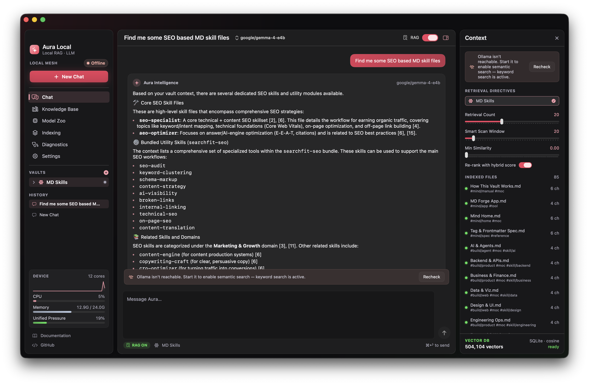
</p>

<p align="center">
  <em>macOS 14+ &nbsp;·&nbsp; Swift / SwiftUI &nbsp;·&nbsp; 100% on-device retrieval and inference</em>
</p>

<p align="center">
  <strong>Source-available · © 2026 srg-sphynx · All rights reserved · <a href="LICENSE">Not open source</a></strong>
</p>

> [!IMPORTANT]
> The source is public so you can **audit** it — not copy it. You may read it and
> build it for personal evaluation. You may **not** redistribute it, publish a
> fork, or ship a derivative or commercial product. See [LICENSE](LICENSE).

---

## Overview

Aura Local turns a folder of your documents into a private, searchable knowledge base and lets you chat with it. It indexes your files locally, builds vector embeddings on-device, and retrieves the most relevant passages to ground each answer — a full Retrieval-Augmented Generation (RAG) pipeline with no external services involved.

It is designed to stay reliable on large corpora (tested against vaults in the hundreds of thousands of chunks) while remaining a native, responsive macOS app.

### Highlights

- **Fully local and private.** Inference and embeddings run through Ollama or LM Studio on your own hardware. Documents are never uploaded.
- **Broad document support.** Markdown/Obsidian, PDF (with optional OCR), DOCX, EPUB, RTF/RTFD, HTML, MediaWiki, CSV/TSV, and plain text — all normalized to Markdown for consistent chunking.
- **Serious retrieval.** Hybrid keyword + semantic search, Reciprocal Rank Fusion re-ranking, parent-document expansion, optional query expansion (Multi-Query / HyDE), and an optional approximate-nearest-neighbor index for large collections.
- **Traceable answers.** Every answer shows the exact sources that grounded it — click a source to open the file in its default app, or browse **Sources in this chat** in the Context inspector to revisit everything the whole conversation drew on.
- **Integrated model management.** A built-in Model Zoo discovers installed models, and an Ollama control panel drives the Ollama CLI (start/stop server, pull, load, unload) directly from the app, with a copyable command cheatsheet.
- **Built-in diagnostics.** A filterable log console, per-file indexing issues, and one-click export make it easy to see exactly what happened.
- **Guided onboarding and deep theming.** A live five-step setup flow, plus light/dark/system themes, accent colors, glass-transparency presets, high-contrast mode, and custom presets. Switching Light/Dark recolors the whole window instantly and in place (no lost scroll position). Text size follows your macOS system setting.

---

## Screenshots

### Chat and knowledge base

| Chat interface | Knowledge base |
| --- | --- |
|  | 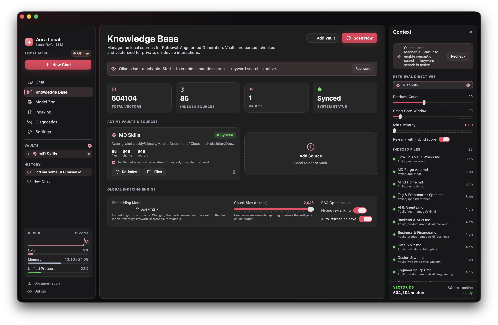 |

Retrieved passages are surfaced alongside each answer, and follow-up questions stay grounded in the conversation through history-aware retrieval.

### Indexing

<p align="center">
  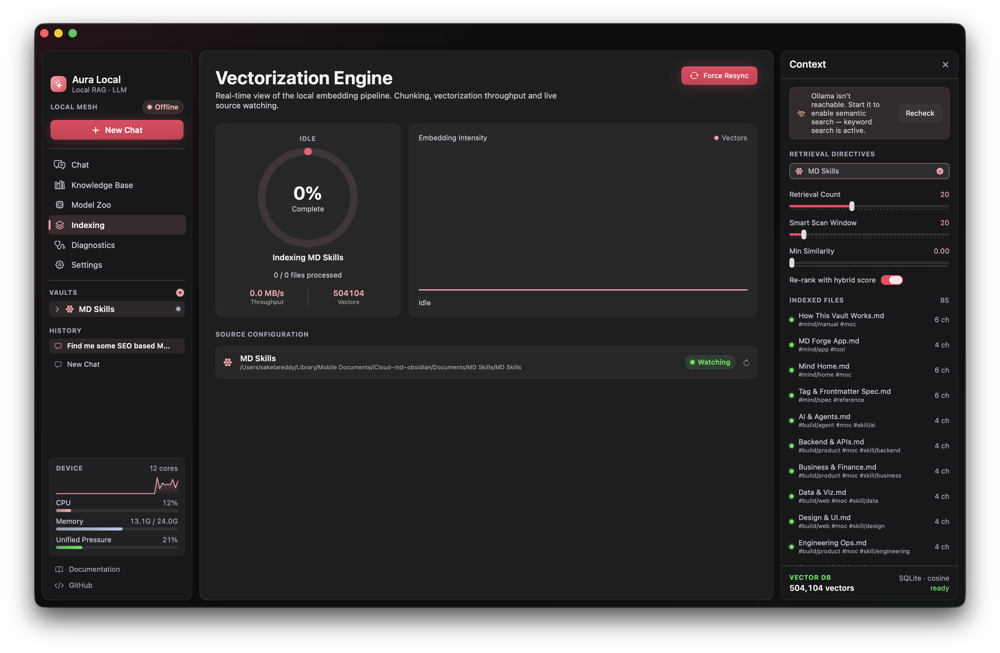
</p>

The indexing pipeline extracts and chunks every supported format, then runs a resumable embedding pass that auto-resumes when the embedding model becomes available.

### Model Zoo and Ollama control

| Model Zoo | Ollama control (CLI) |
| --- | --- |
| 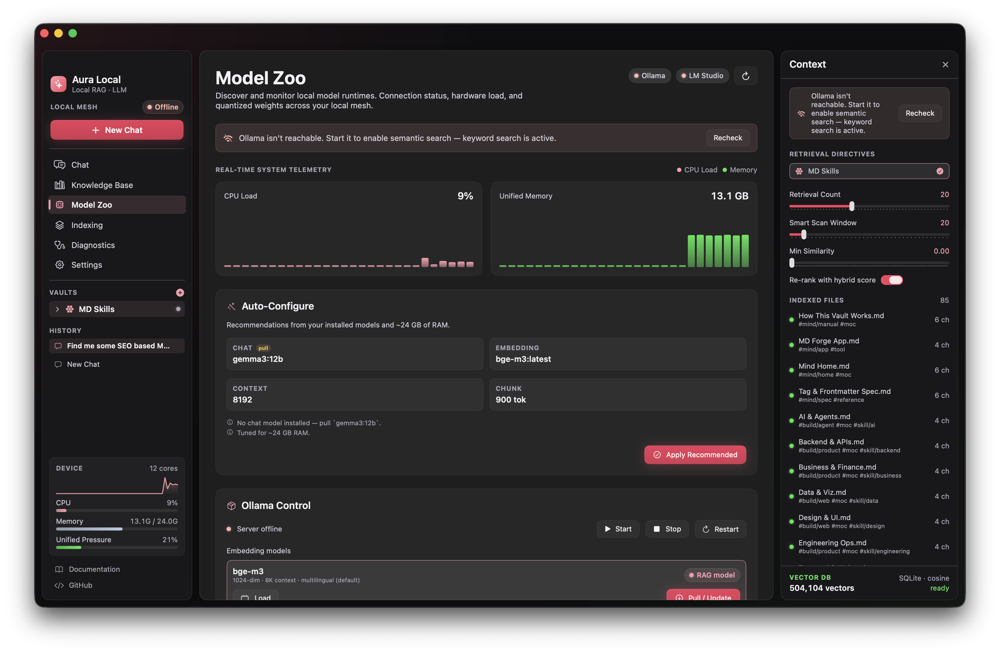 | 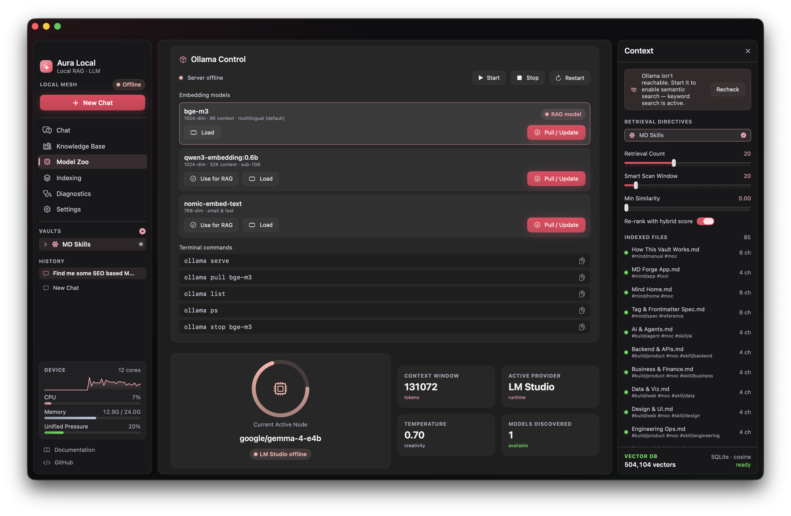 |

| CLI command control | Model settings |
| --- | --- |
| 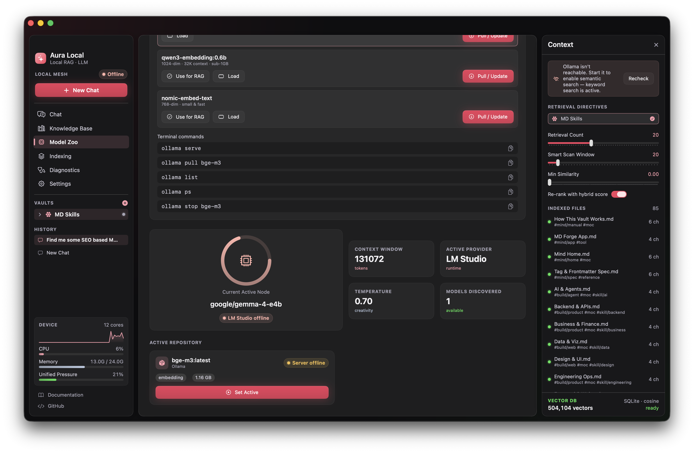 | 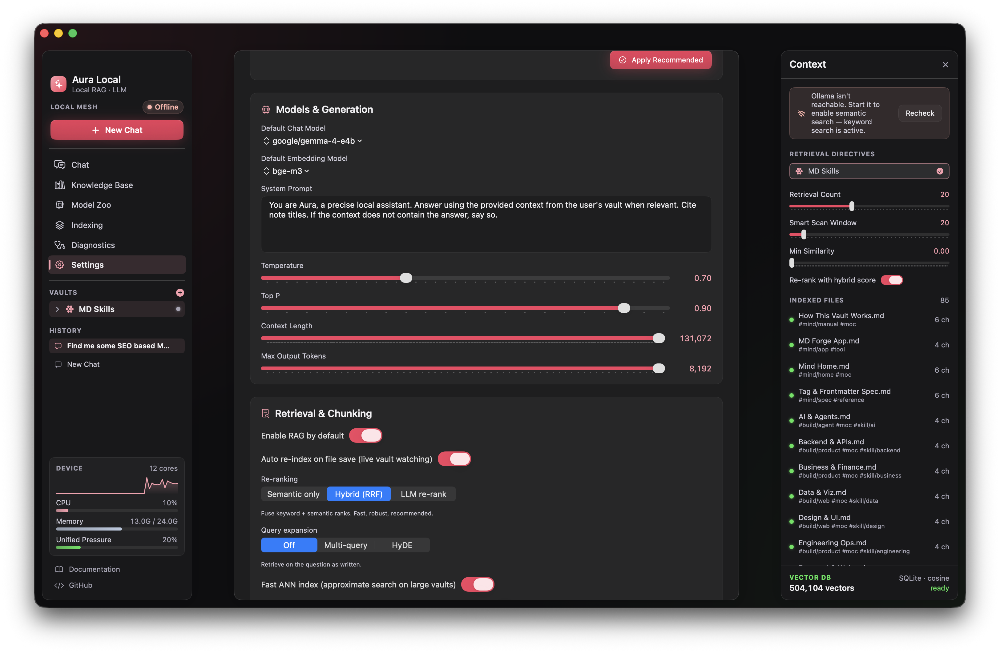 |

Manage local models without leaving the app. When the Ollama server is offline, Aura Local still detects installed models by reading Ollama's on-disk manifests directly.

### Diagnostics

<p align="center">
  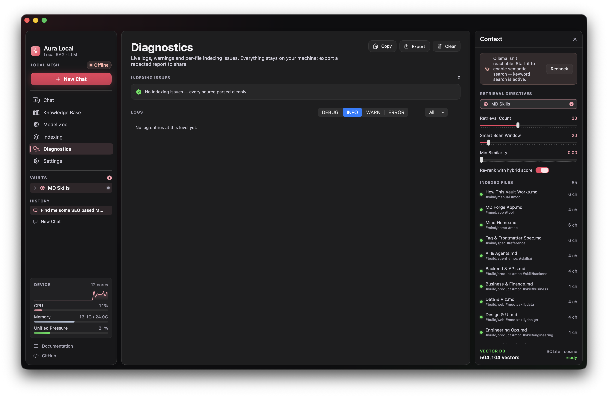
</p>

### Settings and theming

| Settings | Model settings |
| --- | --- |
| 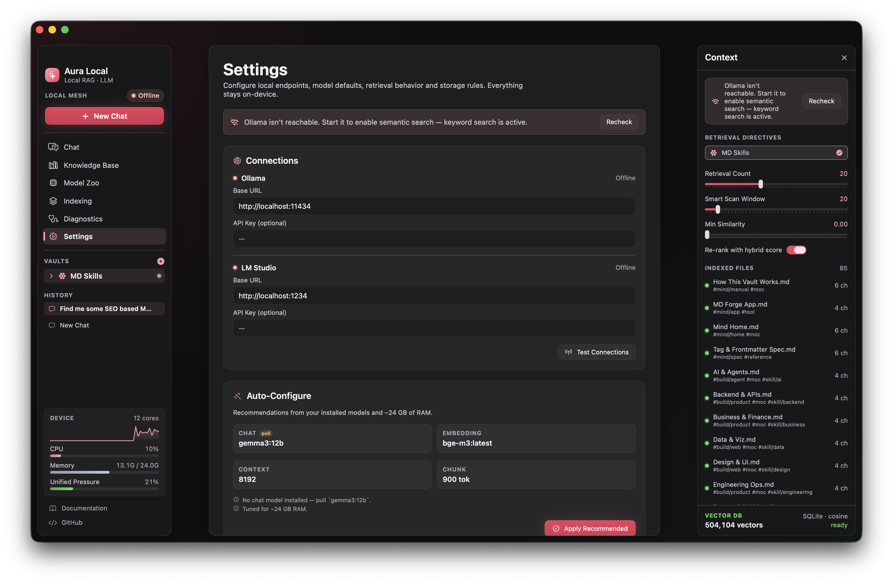 |  |

| Theme engine | Custom themes |
| --- | --- |
| 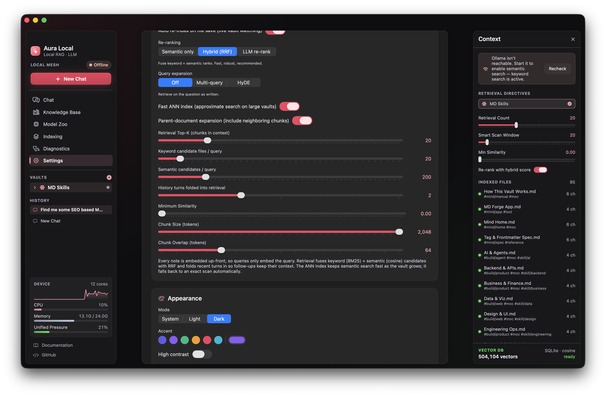 | 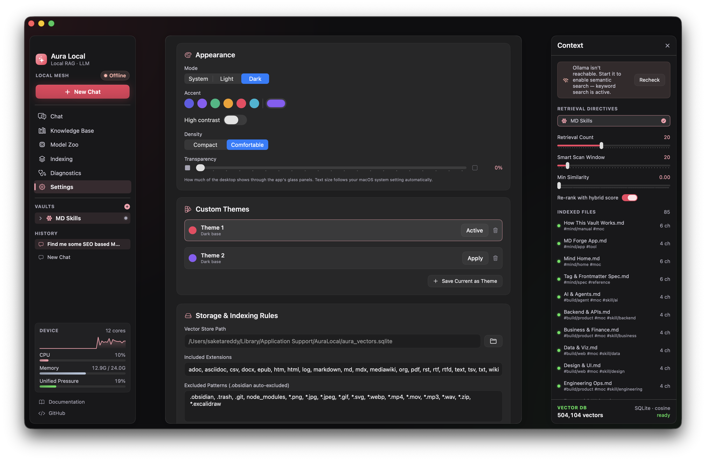 |

---

## Requirements

- macOS 14 (Sonoma) or later
- [Ollama](https://ollama.com) and/or [LM Studio](https://lmstudio.ai) installed locally
- A chat model and an embedding model available to your provider

**Recommended default configuration**

| Role | Provider | Model |
| --- | --- | --- |
| Chat / generation | LM Studio | any capable instruct model |
| Embeddings | Ollama | `bge-m3` (1024-dim) |

Both roles are switchable — Ollama can handle chat and LM Studio can handle embeddings if you prefer.

---

## Installation

### From a release

Download the latest `.dmg` from the [Releases](https://github.com/srg-sphynx/AuraLocal/releases) page, open it, and drag **Aura Local** to your Applications folder.

> **First launch:** current builds are ad-hoc signed rather than notarized. macOS Gatekeeper may warn on first open. If so, right-click the app and choose **Open**, or allow it under **System Settings → Privacy & Security**. See [Known Issues](#known-issues).

### From source

> Building from source is permitted for **personal, non-commercial evaluation
> only**, and does not grant any right to redistribute the result. See [LICENSE](LICENSE).

```bash
git clone https://github.com/srg-sphynx/AuraLocal.git
cd AuraLocal
swift build -c release
```

To build a signed `.app` bundle and a distributable `.dmg`:

```bash
./Packaging/build_app.sh
```

Full build details are in [`docs/BUILDING.md`](docs/BUILDING.md).

---

## Getting started

1. Install and start **Ollama** (`ollama serve`) and/or **LM Studio**, and make sure a chat model and an embedding model are available.
2. Launch Aura Local. The onboarding flow will walk you through selecting a provider and models.
3. Add a folder of documents as a knowledge base.
4. Let the indexing pass complete. The first embedding pass on a large vault is a one-time job and is fully resumable.
5. Start chatting. Answers are grounded in the passages retrieved from your documents.

A complete walkthrough of every screen and setting is in the [User Guide](docs/USER_GUIDE.md).

---

## How it works

Aura Local is a native SwiftUI application backed by a local SQLite store. At a high level:

1. **Ingestion** — every supported file is normalized to Markdown by a format-specific extractor, then split by a single heading-aware chunker so all content is chunked consistently.
2. **Embedding** — chunks are embedded on-device and stored as compact Float16 vectors. The pass is resumable and picks up automatically when the embedding model is ready.
3. **Retrieval** — a query pulls both keyword (BM25) and semantic candidates, fuses them with Reciprocal Rank Fusion, optionally expands to neighboring passages, and returns the top results to the model as grounding context.
4. **Generation** — the chat model answers using the retrieved context, with the sources shown in the interface.

For the full technical design — the extractor set, schema, ANN/IVF index, retrieval modes, and theming system — see [`docs/ARCHITECTURE.md`](docs/ARCHITECTURE.md).

---

## Documentation

- [User Guide](docs/USER_GUIDE.md) — a tour of every feature and setting
- [Architecture](docs/ARCHITECTURE.md) — how ingestion, retrieval, storage, and the UI fit together
- [Building](docs/BUILDING.md) — building from source and producing a release
- [Updates](docs/UPDATES.md) — publishing Sparkle auto-updates (keys, appcast, hosting)
- [Changelog](CHANGELOG.md) — version history

---

## Roadmap

- Additional document formats and extractor coverage
- Notarized, fully signed release builds
- Expanded automated test coverage for the ingestion pipeline

---

## Known issues

We would rather be upfront about the rough edges. If you hit any of these — or anything else — please [open an issue](https://github.com/srg-sphynx/AuraLocal/issues).

- **Unsigned / non-notarized builds.** Current releases are ad-hoc signed. macOS Gatekeeper will warn on first launch; use right-click → **Open** or approve the app in Privacy & Security. Notarized builds are planned.
- **Auto-updates only work in official builds.** The update feed and its signing key are not stored in this repository — they are injected at package time from an untracked `Packaging/release.env` (see [docs/UPDATES.md](docs/UPDATES.md)). A build made from a plain clone ships with auto-update disabled by design; download new versions from Releases instead.
- **Large first-index passes are heavy.** The initial embedding pass on very large vaults (hundreds of thousands of chunks) is a substantial one-time job. It is resumable and runs off the main thread, but it takes time and works your embedding provider hard.
- **Approximate-nearest-neighbor index is opt-in.** The IVF ANN index is disabled by default; exact semantic scan is the verified, default path. Enable ANN only for very large collections, and expect a build step after indexing.
- **Extractors are not yet covered by automated tests.** The multi-format extractors compile and run in the app, but there is no standalone test suite for them yet, so unusual documents may extract imperfectly. Expanding test coverage is on the roadmap.
- **Stale older installs can clobber settings.** Running an old Aura Local binary (for example a v2 copy left in `/Applications`) alongside a newer one can overwrite the settings file with an outdated schema. Keep a single, current install to avoid unexpected setting resets.

---

## Contributing

Issues and pull requests are welcome. For bugs, please include your macOS version, the Aura Local version, your provider/model setup, and any relevant output from the Diagnostics view (which supports one-click export).

By submitting a pull request you agree that your contribution may be used,
modified, relicensed, and commercially exploited by the project owner, as set
out in section 4 of the [LICENSE](LICENSE). You keep the copyright in your own
work — you are granting rights, not signing them away.

---

## License

**Aura Local is source-available, not open source.**
Copyright © 2026 srg-sphynx. All rights reserved.

The source is published so you can read it, audit it, and verify the privacy
claims above — not so it can be copied. See [LICENSE](LICENSE) for the full terms.

| | |
| --- | --- |
| ✅ **You may** | Read and study the source · build and run it locally for your own personal, non-commercial evaluation · open issues and pull requests |
| ❌ **You may not** | Redistribute the source or binaries · publish a fork · ship a derivative or rebranded app · use it commercially · use the "Aura Local" name or icon |

Cloning this repository and publishing your own build of this application —
free or paid — is expressly prohibited.

Bundled third-party components (SwiftSoup, ZIPFoundation, Sparkle) remain under
their own MIT licenses and are unaffected by the above.

For commercial or redistribution licensing, [open an issue](https://github.com/srg-sphynx/AuraLocal/issues).
